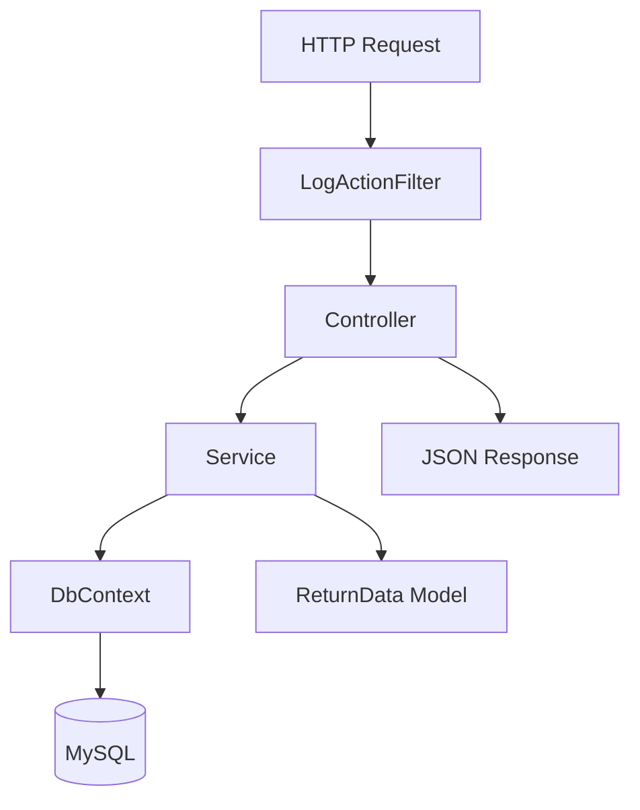
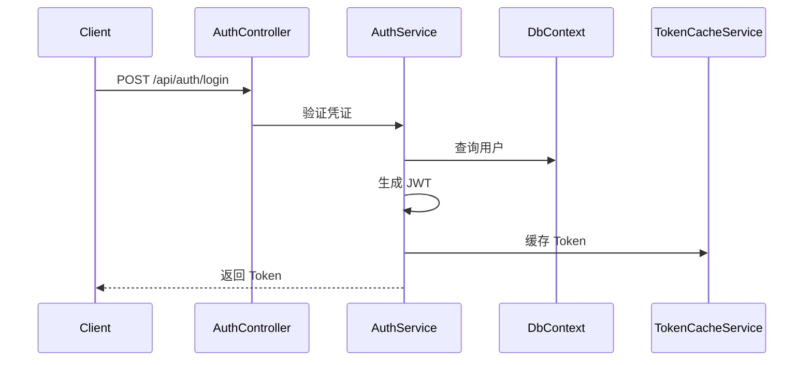

# 架构设计

> 本文档描述项目的架构模式和代码组织方式。

## 整体架构

采用 **分层架构** + **依赖注入** 模式：

```
┌─────────────────────────────────────────────────────┐
│                   Controllers                        │  路由层
│              (请求处理 + 响应封装)                    │
├─────────────────────────────────────────────────────┤
│                    Services                          │  业务层
│              (业务逻辑 + 数据处理)                    │
├─────────────────────────────────────────────────────┤
│                     Data                             │  数据层
│              (DbContext + Entities)                  │
└─────────────────────────────────────────────────────┘
```

## 目录结构详解

```
Endfield/
├── Controllers/           # API 控制器
│   ├── BaseController.cs  # 控制器基类（通用响应）
│   ├── AuthController.cs  # 认证相关
│   ├── BilibiliController.cs
│   └── TagsController.cs
│
├── Services/              # 业务服务
│   ├── IxxxService.cs     # 接口定义
│   └── xxxService.cs      # 实现
│
├── Entities/              # 数据库实体
│   ├── BaseAuditModel.cs  # 审计基类
│   ├── User.cs
│   ├── BilibiliVideo.cs
│   └── ...
│
├── Models/                # 数据传输对象
│   ├── InputDto/          # 输入模型
│   └── ViewModel/         # 输出模型
│
├── Data/                  # 数据访问
│   ├── AppDbContext.cs
│   └── AppDbContextFactory.cs
│
├── Share/                 # 共享代码
│   ├── Enums/             # 枚举定义
│   ├── Models/            # 通用模型（ReturnData）
│   ├── Options/           # 配置选项类
│   └── IOCTag/            # DI 生命周期标记
│
├── Filters/               # 全局过滤器
│   └── LogActionFilter.cs # 请求日志
│
├── Migrations/            # 数据库迁移文件
│
├── Program.cs             # 应用入口
└── appsettings.json       # 配置文件
```

## 依赖注入 (DI)

### 服务生命周期

| 标记接口 | 生命周期 | 使用场景 |
|----------|----------|----------|
| `ISingletonTag` | Singleton | 全局状态（如 Token 缓存） |
| `IScopeTag` | Scoped | 请求级别（如 Service、DbContext） |
| `ITransientTag` | Transient | 轻量级无状态服务 |

### 注册模式

```csharp
// 在 Program.cs 中注册
builder.Services.AddScoped<IXxxService, XxxService>();
builder.Services.AddSingleton<ITokenCacheService, TokenCacheService>();
```

## 请求处理流程



## 统一响应格式

所有 API 返回统一的 `ReturnData<T>` 结构：

```csharp
public class ReturnData<T>
{
    public int Code { get; set; }        // 状态码
    public string Message { get; set; }   // 消息
    public T? Data { get; set; }          // 数据
}
```

### 状态码约定

| Code | 含义 |
|------|------|
| 200 | 成功 |
| 400 | 请求参数错误 |
| 401 | 未授权 |
| 500 | 服务器错误 |

## 数据库设计

### 实体基类

```csharp
public abstract class BaseAuditModel
{
    public int Id { get; set; }
    public DateTime CreatedAt { get; set; }
    public DateTime? UpdatedAt { get; set; }
    public bool IsDeleted { get; set; }  // 软删除标记
}
```

### 关系映射

- **Video ↔ Tag**: 多对多关系（通过 VideoTagMapping）

## 认证流程



---

*最后更新: 2026-03-03*
