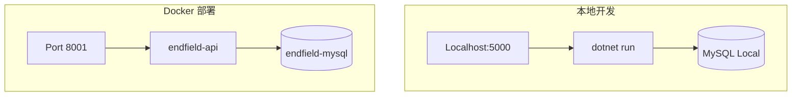

# 运行环境与拓扑

> 本文档规范 Docker 容器行为、环境配置以及本地与线上的差异。

## 环境拓扑



## 环境对照表

| 配置项 | 本地开发 | Docker 部署 |
|--------|----------|-------------|
| 端口 | 5000 (默认) / 5221 (HTTPS) | 8001 |
| 数据库 | localhost:3306 | mysql:3306 (容器内) |
| 配置文件 | appsettings.Development.json | 环境变量覆盖 |
| 日志输出 | 控制台 + 文件 | 文件 (JSON 格式) |

## Docker 配置

### 服务架构

| 服务 | 镜像 | 端口 | 说明 |
|------|------|------|------|
| endfield-api | 自建 (.NET 8) | 8001 | API 服务 |
| endfield-mysql | mysql:8.0 | 3306 | 数据库 |

### 启动命令

```bash
# 进入 Endfield 目录
cd Endfield

# 启动所有服务
docker-compose up -d

# 查看日志
docker-compose logs -f api

# 停止服务
docker-compose down

# 重新构建并启动
docker-compose up -d --build
```

### 健康检查

MySQL 容器配置了健康检查，API 服务会等待 MySQL 就绪后启动：

```yaml
healthcheck:
  test: ["CMD", "mysqladmin", "ping", "-h", "localhost"]
  interval: 10s
  timeout: 5s
  retries: 5
```

## 环境变量

### 必需配置

| 变量名 | 说明 | 示例值 |
|--------|------|--------|
| `ASPNETCORE_ENVIRONMENT` | 运行环境 | `Development` / `Production` |
| `ConnectionStrings__DefaultConnection` | 数据库连接 | `Server=mysql;...` |
| `Jwt__SecretKey` | JWT 密钥 | 最少 32 字符 |
| `Jwt__Issuer` | JWT 签发者 | `Endfield.Api` |
| `Jwt__Audience` | JWT 受众 | `Endfield.Api.Users` |

### Docker Compose 环境变量

```yaml
environment:
  - ASPNETCORE_ENVIRONMENT=Production
  - ConnectionStrings__DefaultConnection=Server=mysql;Port=3306;Database=endfield;User=root;Password=your_password;
  - Jwt__SecretKey=Your_Super_Secret_Key_For_JWT_Authentication_Min_32_Chars
  - Jwt__Issuer=Endfield.Api
  - Jwt__Audience=Endfield.Api.Users
```

## 数据持久化

| 卷名 | 挂载点 | 用途 |
|------|--------|------|
| `mysql-data` | `/var/lib/mysql` | MySQL 数据 |

**注意**: 日志文件存储在容器内 `/app/logs/`，未挂载卷。生产环境建议添加日志卷或使用日志收集系统。

## 网络配置

```yaml
networks:
  endfield-network:
    driver: bridge
```

服务间通信使用容器名作为主机名：
- API 访问 MySQL: `Server=mysql;`
- 外部访问 API: `localhost:8001`

## 常见问题

### 1. MySQL 连接失败

**现象**: API 启动时无法连接数据库

**原因**: MySQL 容器尚未就绪

**解决**: 已配置 `depends_on` + `healthcheck`，等待 MySQL 健康后启动 API

### 2. 时区问题

**现象**: 日志时间与本地时间不一致

**解决**: Dockerfile 已设置时区

```dockerfile
ENV TZ=Asia/Shanghai
RUN ln -snf /usr/share/zoneinfo/$TZ /etc/localtime && echo $TZ > /etc/timezone
```

### 3. macOS 文件挂载权限

**注意**: macOS 上 Docker 挂载可能遇到权限问题，确保配置文件可读。

## 部署检查清单

- [ ] 修改 `docker-compose.yml` 中的密码
- [ ] 修改 `Jwt__SecretKey` 为安全密钥
- [ ] 确认数据库迁移已应用
- [ ] 检查端口 8001 未被占用
- [ ] 验证 API 健康端点

---

*最后更新: 2026-03-03*
