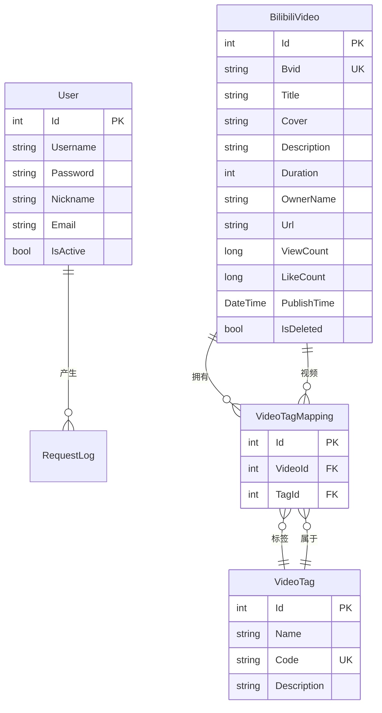
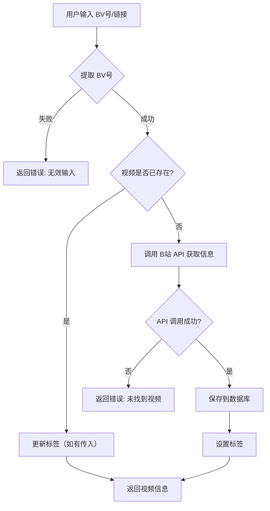
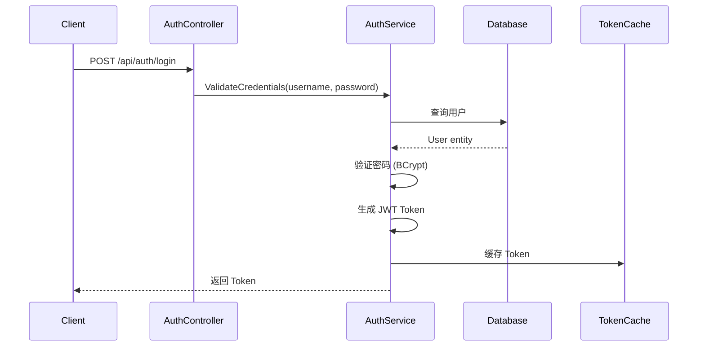

# 业务与领域模型

> 本文档定义项目的业务领域、专有名词、数据关联逻辑以及默认行为。

## 业务概述

Endfield Tool API 是一个 **B站视频收藏管理工具** 的后端服务，核心功能包括：

- 视频信息导入与管理
- 标签分类系统
- 用户认证与权限

## 领域模型

### 实体关系图



## 专有名词定义

| 术语 | 定义 | 示例 |
|------|------|------|
| **BVID** | B站视频唯一标识符，以 BV 开头 | `BV1xx411c7mD` |
| **UP主** | 视频上传者/作者 | 某某动画官方 |
| **软删除** | 标记删除而非物理删除，保留数据 | `IsDeleted = true` |
| **标签映射** | 视频与标签的多对多关联 | VideoTagMapping 表 |

## 核心业务逻辑

### 1. 视频导入流程



### 2. 标签筛选逻辑

**重要**: 标签筛选使用 **AND（交集）** 逻辑，非 OR（并集）。

```
用户选择标签: [游戏, 官方]
返回结果: 必须同时拥有 "游戏" AND "官方" 标签的视频
```

**实现代码** (`BilibiliService.cs:174-184`):

```csharp
// 标签筛选（AND关系）
if (inputDto.TagIds != null && inputDto.TagIds.Count != 0)
{
    var tagIds = inputDto.TagIds.Distinct().ToList();
    var requiredCount = tagIds.Count;

    // 使用子查询：查找拥有所有指定标签的视频
    query = query.Where(v =>
        dbContext.VideoTagMappings
            .Where(m => m.VideoId == v.Id && tagIds.Contains(m.TagId))
            .Count() == requiredCount);
}
```

### 3. 软删除机制

所有实体继承 `BaseAuditModel`，删除操作设置 `IsDeleted = true`：

```csharp
// 删除视频（软删除）
video.IsDeleted = true;
video.UpdatedAt = DateTime.Now;
await dbContext.SaveChangesAsync(token);
```

**注意**: 当前未实现全局查询过滤器，查询时需手动过滤 `IsDeleted = false`。

### 4. 用户认证流程



## 默认行为

| 场景 | 默认行为 |
|------|----------|
| 分页查询 | 按创建时间倒序 (`CreatedAt DESC`) |
| 标签未传入 | 不进行标签过滤 |
| 视频已存在 | 返回已有记录，可选更新标签 |
| Token 过期 | 24 小时（1440 分钟） |
| 密码存储 | BCrypt 加密 |

## 数据校验规则

| 字段 | 规则 |
|------|------|
| BVID | 必须匹配正则 `BV[a-zA-Z0-9]{10,12}` |
| 用户名 | 非空，用于登录 |
| 密码 | 非空，BCrypt 加密存储 |
| 标签ID | 必须存在于 VideoTag 表 |

## 外部 API 依赖

### Bilibili API

| 接口 | 用途 | 限制 |
|------|------|------|
| `/x/web-interface/view?bvid={bvid}` | 获取视频详情 | 需要伪装 Referer 和 User-Agent |

**请求头配置**:

```csharp
User-Agent: Mozilla/5.0 (Windows NT 10.0; Win64; x64) ...
Referer: https://www.bilibili.com
```

---

*最后更新: 2026-03-03*
