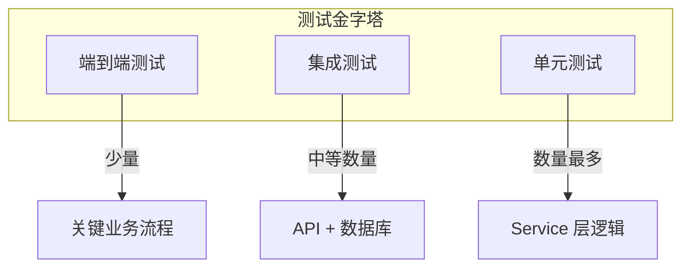

# 验证与测试标准

> 本文档定义测试规范、Mock 数据生成以及接口覆盖率要求。

## 测试策略



## 测试框架

| 组件 | 推荐框架 | 用途 |
|------|----------|------|
| 单元测试 | xUnit | Service 层逻辑测试 |
| Mock 框架 | Moq | 模拟依赖项 |
| 集成测试 | WebApplicationFactory | API 端到端测试 |
| 数据库测试 | In-Memory SQLite | 隔离数据库测试 |

## Mock 数据规范

### 1. 实体 Mock

```csharp
// 推荐：使用工厂方法或 Builder 模式
public static class VideoMockFactory
{
    public static BilibiliVideo CreateValidVideo(string? bvid = null)
    {
        return new BilibiliVideo
        {
            Bvid = bvid ?? "BV1xx411c7mD",
            Title = "测试视频标题",
            Cover = "https://example.com/cover.jpg",
            Duration = 300,
            OwnerName = "测试UP主",
            Url = $"https://www.bilibili.com/video/{bvid ?? "BV1xx411c7mD"}",
            ViewCount = 10000,
            LikeCount = 500,
            PublishTime = DateTime.Now.AddDays(-7),
            CreatedAt = DateTime.Now
        };
    }
}
```

### 2. 外部 API Mock

```csharp
// 使用 HttpClientFactory Mock B站 API
public class MockHttpMessageHandler : HttpMessageHandler
{
    private readonly string _response;

    public MockHttpMessageHandler(string response)
    {
        _response = response;
    }

    protected override Task<HttpResponseMessage> SendAsync(
        HttpRequestMessage request,
        CancellationToken cancellationToken)
    {
        return Task.FromResult(new HttpResponseMessage
        {
            StatusCode = HttpStatusCode.OK,
            Content = new StringContent(_response)
        });
    }
}

// 使用示例
var mockHandler = new MockHttpMessageHandler("""
{
    "code": 0,
    "data": {
        "bvid": "BV1xx411c7mD",
        "title": "测试视频",
        "pic": "https://example.com/cover.jpg",
        "duration": 300,
        "owner": { "name": "UP主" },
        "stat": { "view": 10000, "like": 500 }
    }
}
""");

var httpClient = new HttpClient(mockHandler);
```

### 3. 数据库 Mock

```csharp
// 使用 In-Memory SQLite 进行隔离测试
public class TestDbContextFactory
{
    public static async Task<AppDbContext> CreateAsync()
    {
        var connection = new SqliteConnection("DataSource=:memory:");
        await connection.OpenAsync();

        var options = new DbContextOptionsBuilder<AppDbContext>()
            .UseSqlite(connection)
            .Options;

        var context = new AppDbContext(options);
        await context.Database.EnsureCreatedAsync();

        return context;
    }
}
```

## 单元测试规范

### 命名约定

```
{MethodName}_{Scenario}_{ExpectedResult}

示例:
- ImportVideoAsync_ValidBvid_ReturnsVideo
- ImportVideoAsync_InvalidBvid_ReturnsError
- ImportVideoAsync_ExistingVideo_UpdatesTags
```

### 测试结构 (AAA 模式)

```csharp
[Fact]
public async Task ImportVideoAsync_ValidBvid_ReturnsVideo()
{
    // Arrange (准备)
    var mockDbContext = CreateMockDbContext();
    var mockHttpClient = CreateMockHttpClient();
    var service = new BilibiliService(mockHttpClient, mockLogger, mockDbContext);
    var input = new ImportVideoInputDto { Input = "BV1xx411c7mD" };

    // Act (执行)
    var result = await service.ImportVideoAsync(input);

    // Assert (断言)
    Assert.True(result.IsSuccess);
    Assert.Equal("BV1xx411c7mD", result.Data?.Bvid);
}
```

### 边界用例覆盖

| 场景 | 测试用例 |
|------|----------|
| 正常流程 | 有效 BVID 导入成功 |
| 输入校验 | 空 BVID、无效格式 |
| 重复数据 | BVID 已存在时更新标签 |
| 外部依赖 | B站 API 返回错误、网络超时 |
| 并发场景 | 同时导入相同 BVID |

## 集成测试规范

### API 测试示例

```csharp
public class VideoApiTests : IClassFixture<WebApplicationFactory<Program>>
{
    private readonly WebApplicationFactory<Program> _factory;
    private readonly HttpClient _client;

    public VideoApiTests(WebApplicationFactory<Program> factory)
    {
        _factory = factory;
        _client = factory.CreateClient();
    }

    [Fact]
    public async Task GetVideoById_ExistingId_ReturnsOk()
    {
        // Act
        var response = await _client.GetAsync("/api/bilibili/1");

        // Assert
        response.EnsureSuccessStatusCode();
        var content = await response.Content.ReadAsStringAsync();
        Assert.Contains("\"code\":200", content);
    }
}
```

## 覆盖率要求

| 层级 | 最低覆盖率 | 重点覆盖 |
|------|------------|----------|
| Service 层 | 80% | 核心业务逻辑 |
| Controller 层 | 60% | 参数校验、异常处理 |
| Repository 层 | 50% | 查询逻辑 |

### 查看覆盖率

```bash
# 安装覆盖率工具
dotnet tool install -g dotnet-coverage

# 运行测试并收集覆盖率
dotnet-coverage collect "dotnet test" -o coverage.xml

# 生成报告 (需要 reportgenerator)
dotnet tool install -g dotnet-reportgenerator-globaltool
reportgenerator -reports:coverage.xml -targetdir:coverage-report
```

## 测试数据隔离

### 原则

1. **独立性**: 测试之间互不影响
2. **可重复**: 每次运行结果一致
3. **自清理**: 测试后清理数据

### 最佳实践

```csharp
// 使用 IAsyncLifetime 进行数据准备和清理
public class VideoServiceTests : IAsyncLifetime
{
    private AppDbContext _context = null!;

    public async Task InitializeAsync()
    {
        _context = await TestDbContextFactory.CreateAsync();
        // 种子数据
        _context.VideoTags.Add(new VideoTag { Name = "测试标签", Code = "test" });
        await _context.SaveChangesAsync();
    }

    public async Task DisposeAsync()
    {
        await _context.DisposeAsync();
    }
}
```

## 运行测试

```bash
# 运行所有测试
dotnet test

# 运行特定测试
dotnet test --filter "FullyQualifiedName~ImportVideoAsync"

# 运行并显示详细输出
dotnet test --verbosity normal
```

---

*最后更新: 2026-03-03*
